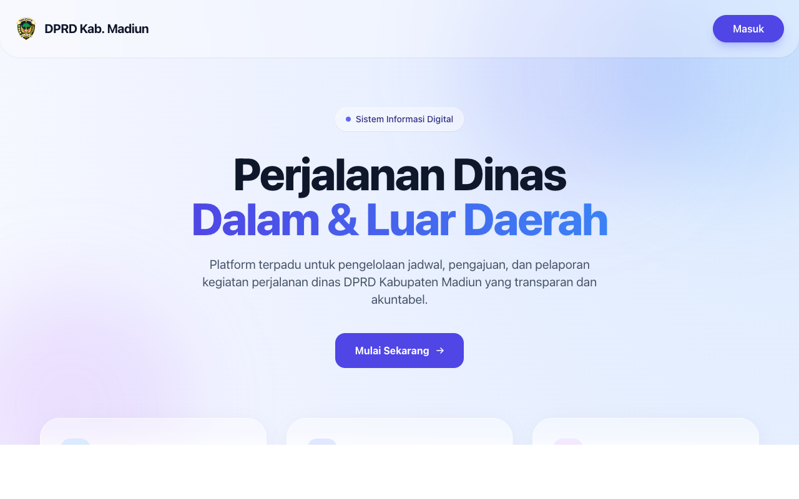
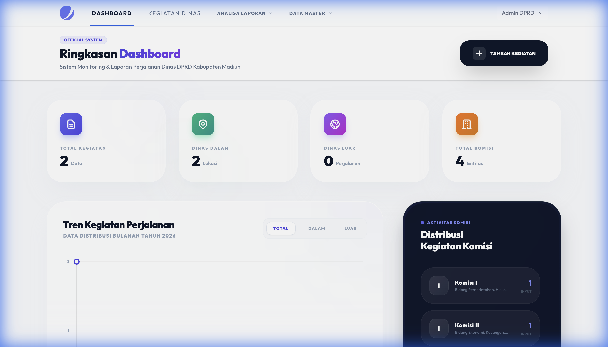
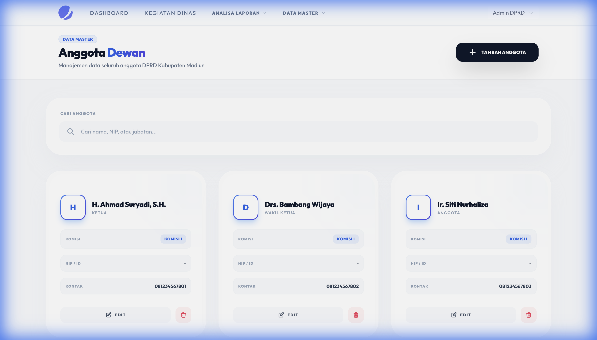
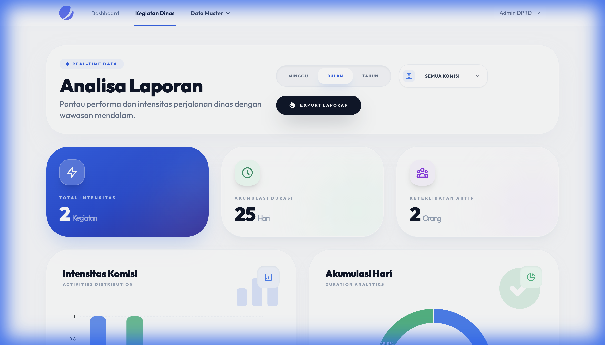

# Sistem Informasi Perjalanan Dinas DPRD Kabupaten Madiun



Platform digital modern untuk pengelolaan jadwal, pengajuan, dan pelaporan kegiatan perjalanan dinas Anggota dan Sekretariat DPRD Kabupaten Madiun. Dibangun dengan fokus pada **transparansi**, **efisiensi**, dan **akuntabilitas**, aplikasi ini menghadirkan antarmuka *Premium Glassmorphism* yang intuitif dan responsif.

## 🌟 Fitur Unggulan

*   **Premium Glassmorphism UI**: Antarmuka modern dengan efek blur, gradien halus, dan tipografi "Outfit" yang elegan.
*   **Manajemen Data Master**: Pengelolaan data Komisi, Anggota, Pegawai, dan Pendamping yang terstruktur.
*   **Alur Kerja Digital**: Proses pengajuan Surat Perintah Tugas (SPT) dan verifikasi yang terintegrasi.
*   **Analisa & Pelaporan**: Dashboard interaktif dengan grafik statistik (ApexCharts) dan laporan yang dapat difilter berdasarkan tanggal (Mingguan/Bulanan/Tahunan).
*   **Lokalisasi Bahasa Indonesia**: Seluruh sistem menggunakan Bahasa Indonesia yang baku dan mudah dipahami.
*   **Keamanan Terjamin**: Mendukung Two-Factor Authentication (2FA) dan manajemen sesi browser.

## 📸 Galeri Tampilan

| Halaman Utama | Dashboard |
| :---: | :---: |
|  |  |

| Manajemen Anggota | Laporan Statistik |
| :---: | :---: |
|  |  |

## 🛠 Teknologi

Aplikasi ini dibangun menggunakan *stack* teknologi modern yang menjamin performa dan kemudahan pengembangan:

*   **Backend**: [Laravel 12](https://laravel.com)
*   **Frontend**: [Blade Templates](https://laravel.com/docs/blade) & [Alpine.js](https://alpinejs.dev)
*   **Live Components**: [Livewire 3](https://livewire.laravel.com)
*   **Styling**: [Tailwind CSS](https://tailwindcss.com)
*   **Database**: MySQL
*   **Assets Bundler**: Vite

## 🚀 Instalasi

Ikuti langkah-langkah berikut untuk menjalankan proyek di lingkungan lokal Anda:

1.  **Clone Repositori**
    ```bash
    git clone https://github.com/username/dprp-dinas-dalam-luar.git
    cd dprp-dinas-dalam-luar
    ```

2.  **Instal Dependensi**
    ```bash
    composer install
    npm install
    ```

3.  **Konfigurasi Environment**
    Salin file `.env.example` menjadi `.env` dan sesuaikan konfigurasi database Anda.
    ```bash
    cp .env.example .env
    php artisan key:generate
    ```

4.  **Migrasi Database**
    ```bash
    php artisan migrate --seed
    ```

5.  **Jalankan Aplikasi**
    Jalankan server pengembangan Laravel dan Vite secara bersamaan (atau di terminal terpisah).
    ```bash
    php artisan serve
    npm run dev
    ```

    Akses aplikasi melalui browser di `http://localhost:8000`.

## 📄 Lisensi

Proyek ini adalah perangkat lunak propertari milik **Sekretariat DPRD Kabupaten Madiun**. Dilarang mendistribusikan ulang tanpa izin tertulis.

---
&copy; 2024 DPRD Kabupaten Madiun. All rights reserved.
